# Инструкция по работе с админ-панелью Park Relax

> **Адрес:** `https://parkrelax.by/admin`  
> **Проект:** `~/PyCharmProjects/parkrelax`

---

## Содержание

1. [Вход в админ-панель](#1-вход-в-админ-панель)
2. [Структура меню](#2-структура-меню)
3. [Дашборд](#3-дашборд)
4. [Быстрый старт](#4-быстрый-старт)
5. [Пользователи](#5-пользователи)
6. [Бронирование](#6-бронирование)
7. [Оплаты](#7-оплаты)
8. [Типы размещения](#8-типы-размещения)
9. [Размещения](#9-размещения)
10. [Галерея апартаментов](#10-галерея-апартаментов)
11. [Особенности размещения](#11-особенности-размещения)
12. [Зоны отдыха (аренда)](#12-зоны-отдыха-аренда)
13. [Удобства и Настройки секции](#13-удобства-и-настройки-секции)
14. [Прайс-лист](#14-прайс-лист)
15. [Юридические страницы](#15-юридические-страницы)
16. [Контакты](#16-контакты)
17. [Отзывы](#17-отзывы)
18. [Почта](#18-почта)
19. [Слайдер](#19-слайдер)
20. [Администраторы](#20-администраторы)
21. [Общие правила работы с таблицами](#21-общие-правила-работы-с-таблицами)
22. [Работа с Rich Text](#22-работа-с-rich-text)
23. [Работа с изображениями](#23-работа-с-изображениями)
24. [FAQ](#24-faq)
25. [Чек-лист контент-менеджера](#25-чек-лист-контент-менеджера)

---

## 1. Вход в админ-панель

Откройте в браузере адрес `https://parkrelax.by/admin`. Если вы уже авторизованы, система сразу перенаправит на **Дашборд**.

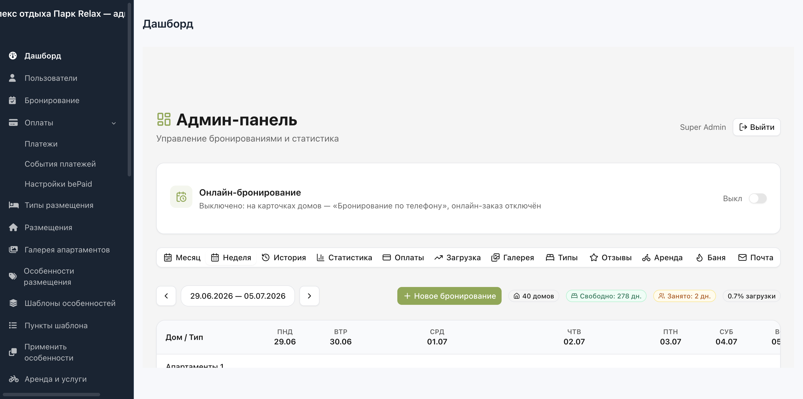

---

## 2. Структура меню

Слева расположено основное меню администратора:

| Раздел | Назначение |
|--------|------------|
| **Дашборд** | Главная страница с общей статистикой |
| **Пользователи** | Список зарегистрированных пользователей |
| **Бронирование** | Управление бронированиями |
| **Оплаты** | Платежи, события и настройки bePaid |
| **Типы размещения** | Категории жилья (домики, номера) |
| **Размещения** | Конкретные объекты (комнаты, домики) |
| **Галерея апартаментов** | Фотографии объектов |
| **Особенности размещения** | Дополнительные характеристики |
| **Шаблоны особенностей** | Шаблоны для быстрого применения |
| **Пункты шаблона** | Элементы шаблонов |
| **Применить особенности** | Массовое применение характеристик |
| **Аренда и услуги** | Зоны отдыха и доп. услуги |
| **Удобства** | Список удобств (Wi-Fi, кондиционер) |
| **Настройки секции** | Быстрые теги, категории, пункты |
| **Прайс-лист** | Загрузка Excel-прайса и JSON |
| **Юридические страницы** | Правовые документы |
| **Контакты** | Телефоны и email |
| **Отзывы** | Отзывы клиентов |
| **Почта** | SMTP, шаблоны и отправленные письма |
| **Слайдер** | Галерея и слайдер на странице "О нас" |
| **Администраторы** | Управление доступом |
| **Выйти** | Завершение сессии |

---

## 3. Дашборд

Главная страница с общей статистикой: количество бронирований, пользователей, платежей.

---

## 4. Быстрый старт

### Как создать новое размещение с нуля

1. Перейдите в раздел **Типы размещения** → создайте категорию (например, "Домик").
2. Перейдите в раздел **Размещения** → нажмите **"+ Добавить Accommodation"**.
3. Заполните поля: Название, Описание, Тип размещения, Вместимость, Цена за ночь.
4. Загрузите главное изображение (обложку) и галерею фотографий.
5. Установите галочки **Активно** и при необходимости **Показывать на главной**.
6. Нажмите **Сохранить**.

### Как обработать новое бронирование

1. Раздел **Бронирование** — новая бронь появляется со статусом `pending`.
2. Откройте бронь на редактирование (иконка ✏️).
3. Проверьте данные клиента, даты, объект.
4. Измените **Статус** на `confirmed` (подтверждено) или `cancelled` (отменено).
5. Добавьте примечания при необходимости.
6. Сохраните.

### Как обновить прайс-лист

1. Подготовьте Excel-файл с актуальными ценами.
2. Перейдите в **Прайс-лист** → откройте запись на редактирование.
3. Загрузите новый файл в поле **Excel файл**.
4. Сохраните — система автоматически распарсит данные в JSON.

> **Важно:** Формат Excel-файла должен соответствовать ожидаемой структуре. При изменении структуры прайс-листа свяжитесь с разработчиком.

---

## 5. Пользователи

Раздел управления зарегистрированными пользователями сайта.

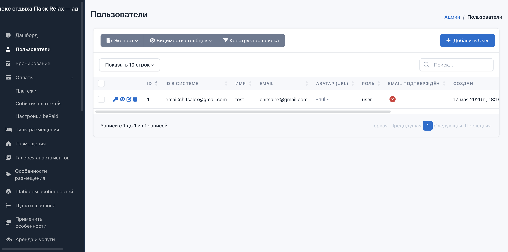

**Колонки:** ID, Email, Телефон, Имя, Создан.

**Действия:** Поиск, Экспорт, Видимость столбцов, Конструктор поиска, Просмотр (👁), Редактирование (✏️), Удаление (🗑).

---

## 6. Бронирование

### 6.1 Список бронирований

**Колонки:** ID, Имя клиента, Телефон, Email, Дата заезда, Дата выезда, Взрослые, Дети, Размещение, Статус, Создано.

### 6.2 Добавление бронирования

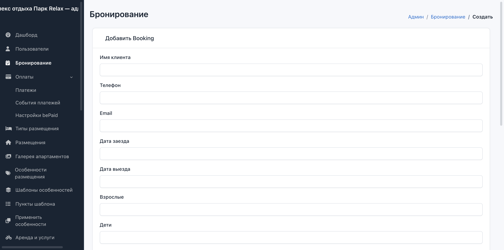

| Поле | Тип | Описание |
|------|-----|----------|
| **Имя клиента** | Текст | ФИО гостя |
| **Телефон** | Текст | Контактный номер |
| **Email** | Текст | Адрес электронной почты |
| **Дата заезда** | Дата | Начало проживания (ГГГГ-ММ-ДД) |
| **Дата выезда** | Дата | Окончание проживания |
| **Взрослые** | Число | Количество взрослых |
| **Дети** | Число | Количество детей |
| **ID размещения** | Число | Внутренний ID объекта |
| **ID пользователя** | Число | ID зарегистрированного пользователя |
| **Статус** | Текст | pending, confirmed, cancelled и т.д. |
| **Примечания** | Текстовая область | Дополнительная информация |

### 6.3 Редактирование бронирования

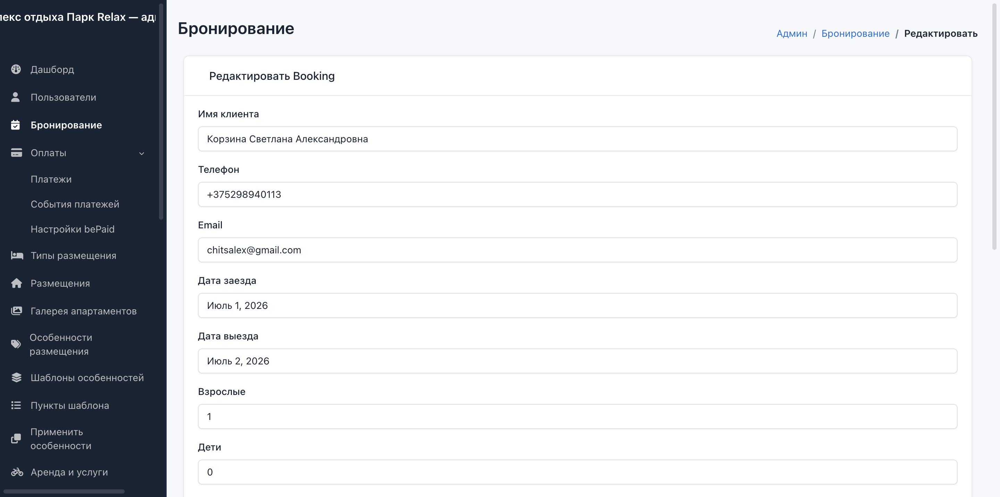

Форма редактирования аналогична форме добавления. При редактировании можно изменить статус, даты, количество гостей и примечания.

---

## 7. Оплаты

### 7.1 Платежи

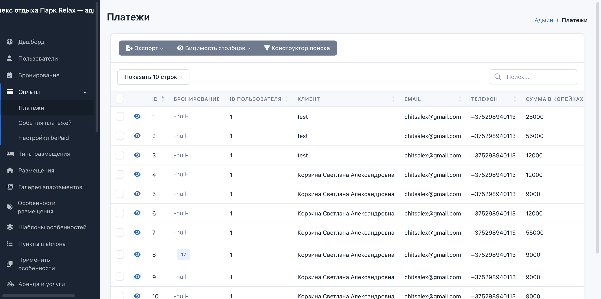

**Колонки:** ID, Бронирование, Сумма, Статус, Метод, Создано.

### 7.2 События платежей

Лог всех событий, связанных с платежами (webhooks, callback-уведомления от платежной системы).

### 7.3 Настройки bePaid

Конфигурация интеграции с платежной системой bePaid (ID магазина, секретные ключи, тестовый/боевой режим).

> **Внимание:** Не изменяйте настройки bePaid без консультации с разработчиком.

---

## 8. Типы размещения

Категории жилья для группировки объектов: "Домики", "Номера", "Апартаменты".

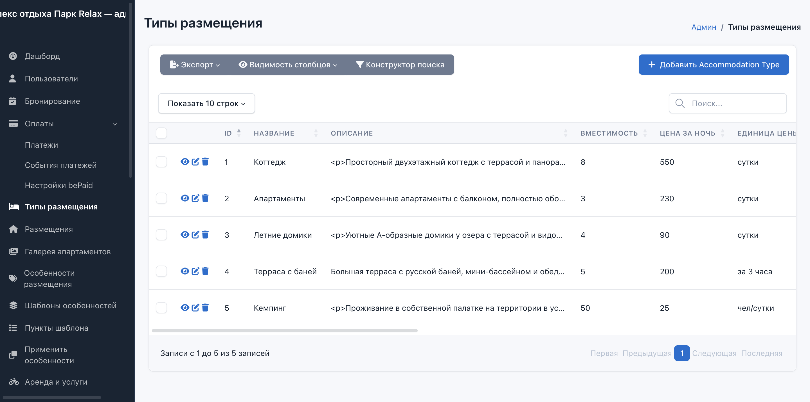

### Форма добавления/редактирования типа

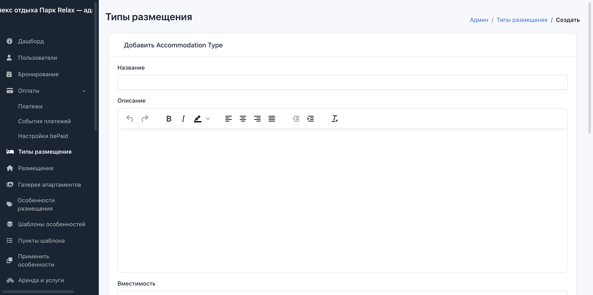

| Поле | Тип | Описание |
|------|-----|----------|
| **Название** | Текст | Название типа (например, "Домик") |
| **Описание** | Rich Text | Описание с форматированием |
| **Вместимость** | Число | Максимальное количество гостей |

---

## 9. Размещения

Конкретные объекты — комнаты, домики, номера, которые можно забронировать.

### 9.1 Список размещений

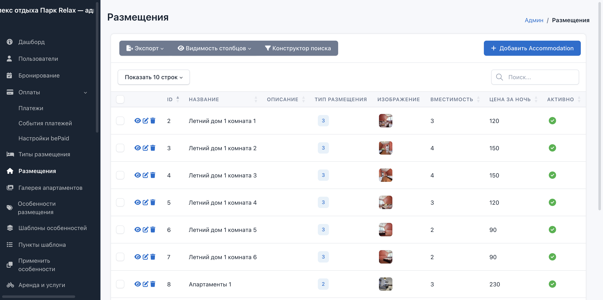

### 9.2 Добавление размещения

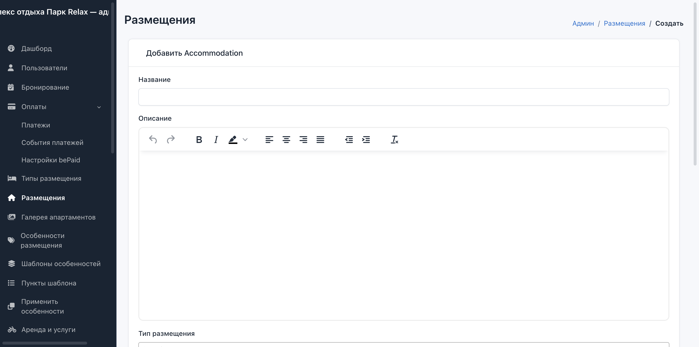

Форма создания нового объекта аналогична форме редактирования.

### 9.3 Редактирование размещения

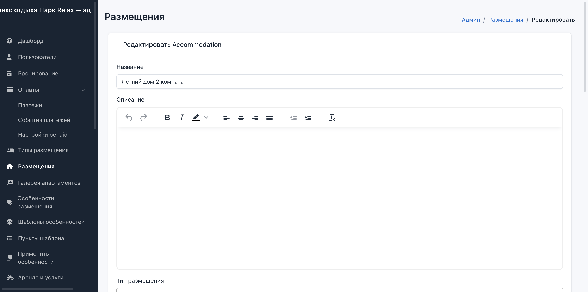

| Поле | Тип | Описание |
|------|-----|----------|
| **Название** | Текст | Название объекта |
| **Описание** | Rich Text | Подробное описание с форматированием |
| **Тип размещения** | Выпадающий список | Выбор категории |
| **Изображение** | Файл | Главное фото (обложка) |
| **Вместимость** | Число | Максимальное количество гостей |
| **Цена за ночь** | Число | Базовая стоимость (BYN) |
| **Активно** | Чекбокс | Отображать на сайте |
| **Показывать на главной** | Чекбокс | Показывать в блоке "Рекомендуем" |
| **Порядок сортировки** | Число | Чем меньше, тем выше в списке |
| **Галерея** | Загрузка файлов | Массовая загрузка + crop |

> **Совет:** Поле "Активно" определяет видимость на сайте. Если снять галочку — объект скроется из каталога, но останется в базе. Для удаления используйте иконку 🗑.

---

## 10. Галерея апартаментов

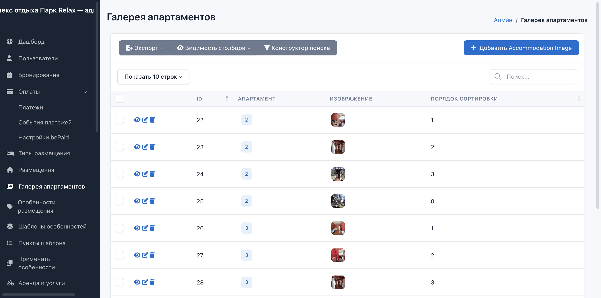

Управление фотографиями для всех объектов размещения. Загружайте фото к конкретным объектам, используйте массовую загрузку и задавайте порядок отображения.

---

## 11. Особенности размещения

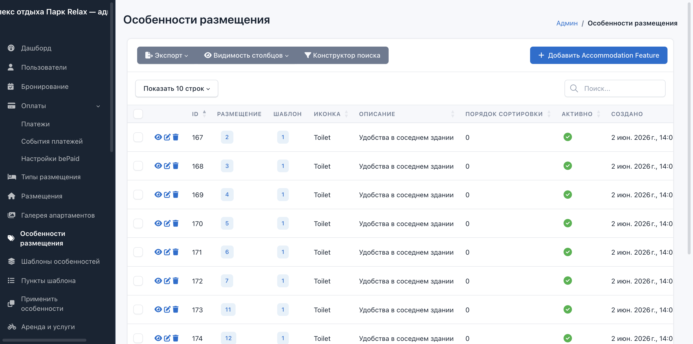

Дополнительные характеристики объектов: наличие балкона, вид на озеро, дровяная печь и т.д.

### 11.1 Шаблоны особенностей

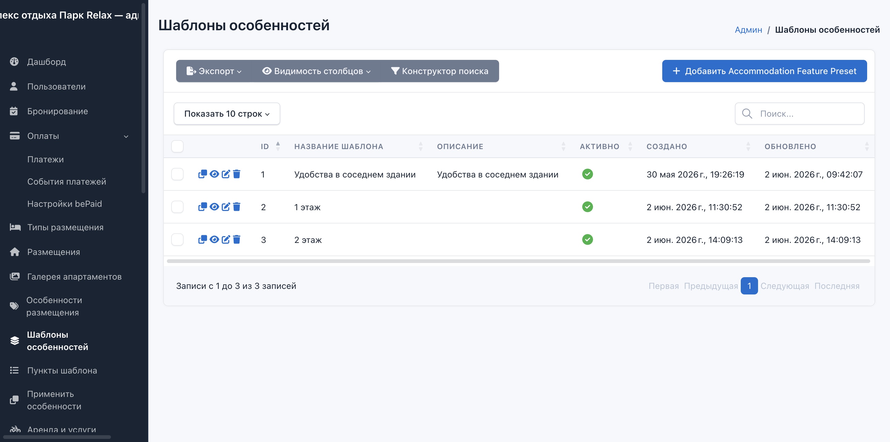

Готовые наборы характеристик для быстрого применения к нескольким объектам.

### 11.2 Пункты шаблона

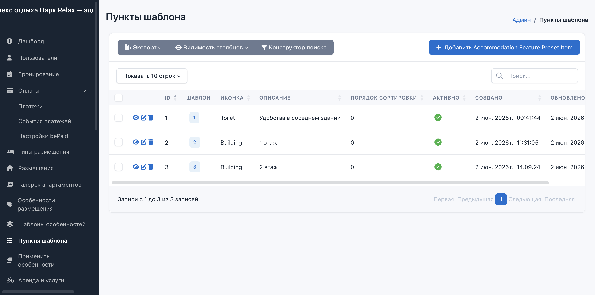

Отдельные элементы внутри шаблона. Например, шаблон "Комфорт" может содержать: "Кондиционер", "Тёплые полы", "Smart TV".

### 11.3 Применить особенности

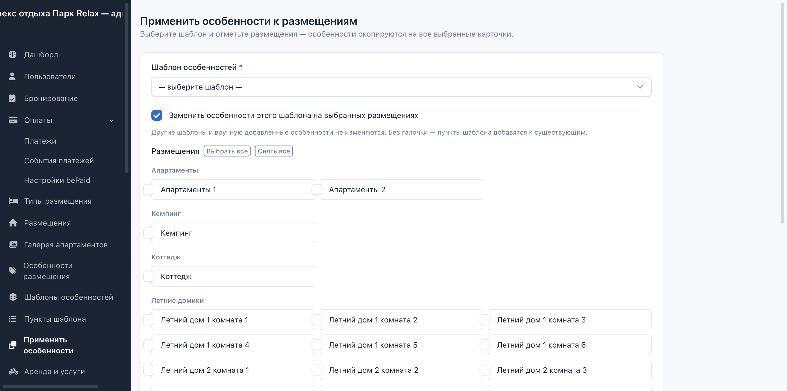

Массовое применение шаблонов характеристик к выбранным объектам размещения.

---

## 12. Зоны отдыха (аренда)

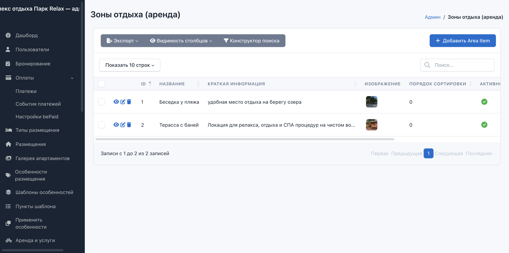

Управление дополнительными зонами и услугами: бани, беседки, мангал-зоны, спортивные площадки.

**Колонки:** ID, Название, Описание, Цена, Активно.

---

## 13. Удобства и Настройки секции

### 13.1 Удобства

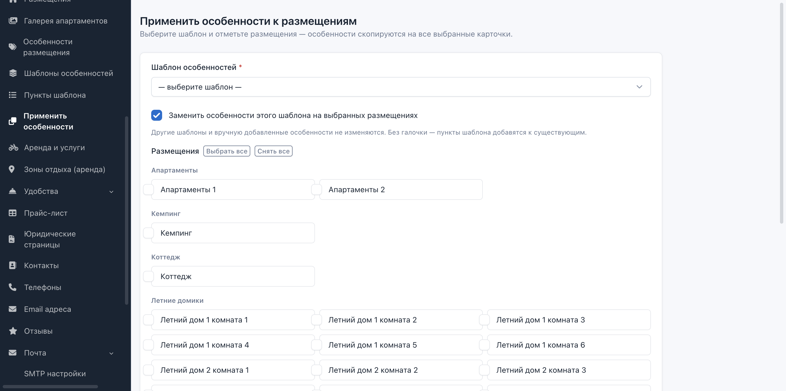

Справочник удобств: Wi-Fi, кондиционер, парковка, холодильник и т.д. Удобства привязываются к объектам размещения.

### 13.2 Настройки секции

Управление отображением секций на сайте.

### 13.3 Быстрые теги

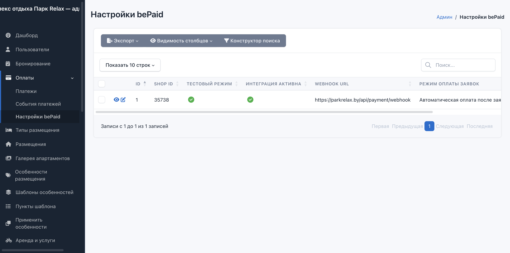

Теги для быстрой фильтрации объектов на сайте: "Семейный", "Романтический", "Эконом".

### 13.4 Категории

Категории для группировки объектов и услуг.

### 13.5 Пункты

Отдельные пункты внутри категорий.

---

## 14. Прайс-лист

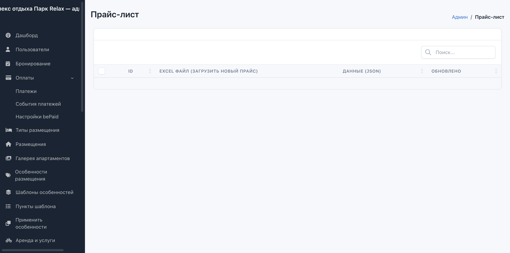

Управление ценами через загрузку Excel-файла или редактирование JSON-данных.

**Структура:** одна запись с актуальным прайсом. `Excel файл` — загрузка .xlsx, `Данные (JSON)` — структурированные цены, `Обновлено` — дата последней загрузки.

---

## 15. Юридические страницы

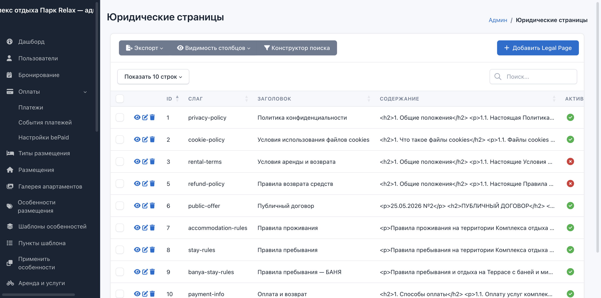

Управление правовыми документами: договор оферты, политика конфиденциальности, правила проживания. Контент редактируется через Rich Text редактор.

---

## 16. Контакты

### 16.1 Телефоны

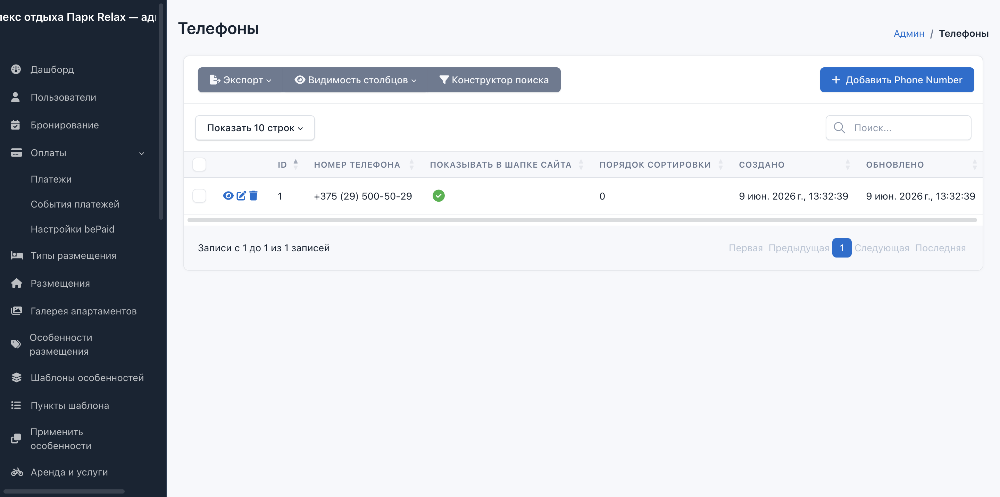

**Поля:** Номер (+375 XX XXX-XX-XX), Описание ("Ресепшн 24/7"), Порядок, Активно.

### 16.2 Email адреса

Аналогично телефонам — управление email для разных целей (бронирование, общие вопросы, жалобы).

---

## 17. Отзывы

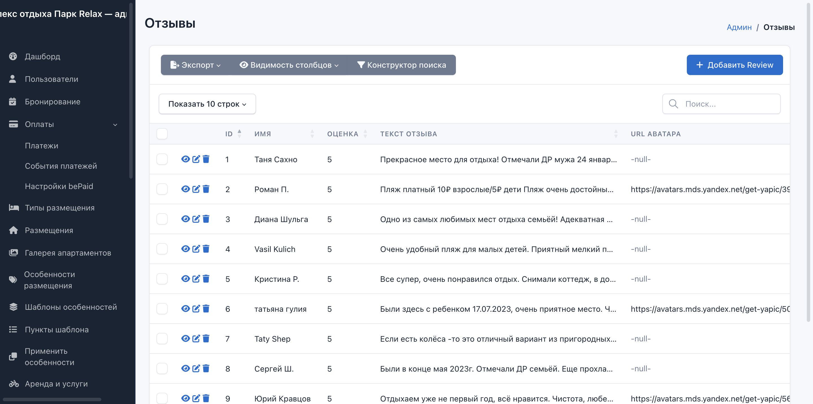

**Колонки:** ID, Имя, Email, Рейтинг (1-5), Текст, Одобрен, Создан.

> **Модерация:** Новые отзывы не появляются на сайте до одобрения администратором. Проверяйте раздел регулярно.

---

## 18. Почта

### 18.1 SMTP настройки

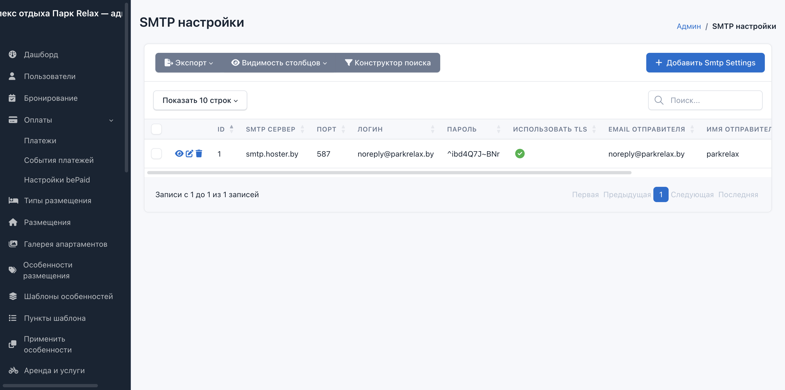

Конфигурация почтового сервера: хост, порт, логин, пароль, шифрование (SSL/TLS). Отвечает за отправку всех писем с сайта.

> **Важно:** Не изменяйте SMTP-настройки без консультации с разработчиком. Неправильная конфигурация приведет к недоставке писем.

### 18.2 Шаблоны писем

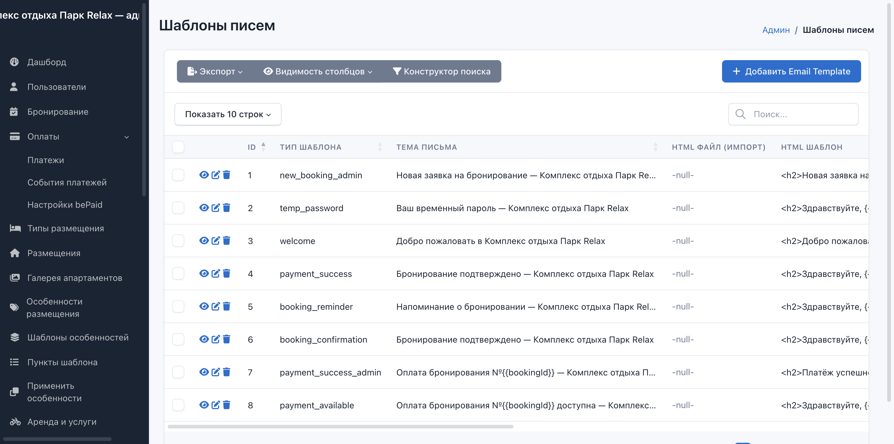

Управление шаблонами email-уведомлений: подтверждение бронирования, напоминание о заезде, благодарность за отзыв. Поддерживаются переменные (например, `{customerName}`, `{bookingId}`).

### 18.3 Отправленные письма

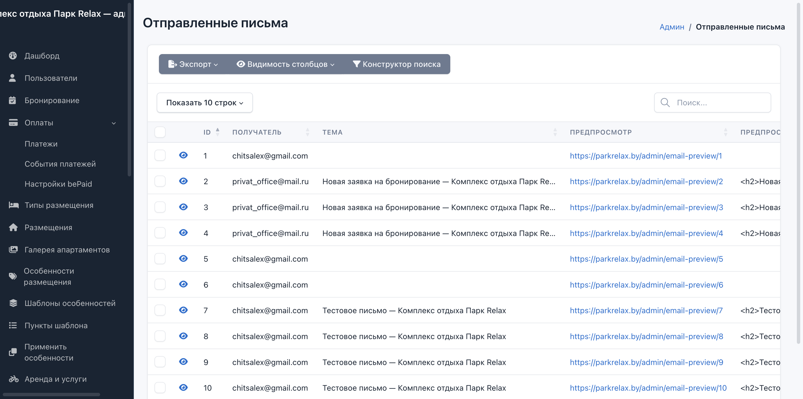

История отправленных писем: получатель, тема, статус доставки, дата отправки. Полезно для диагностики проблем с доставкой.

---

## 19. Слайдер

### 19.1 Галерея

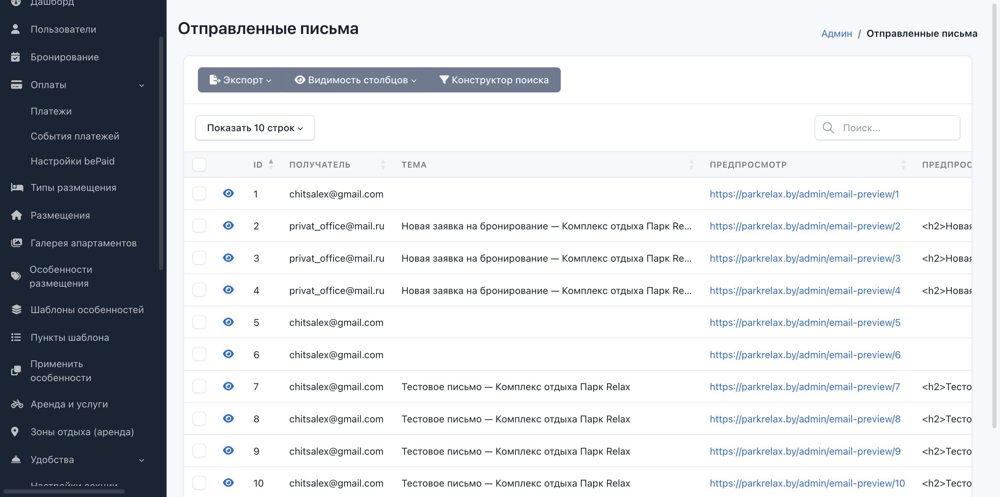

Управление изображениями для слайдера на главной странице. Для каждого слайда можно задать заголовок, изображение, порядок сортировки и активность.

### 19.2 Слайдер О нас

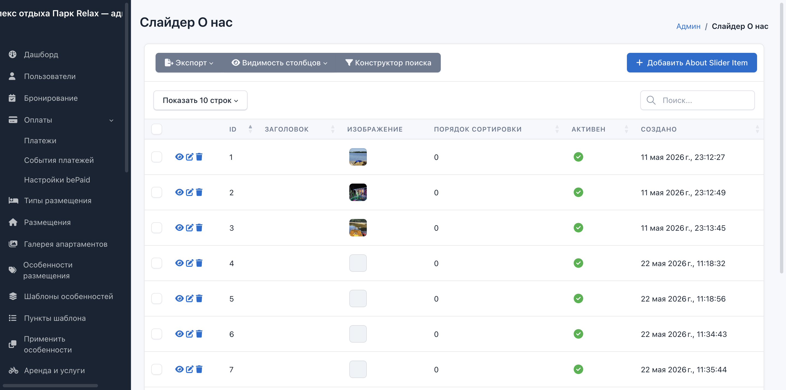

Фотографии для страницы "О нас". Колонки: ID, Заголовок, Изображение, Порядок сортировки, Активен, Создано.

---

## 20. Администраторы

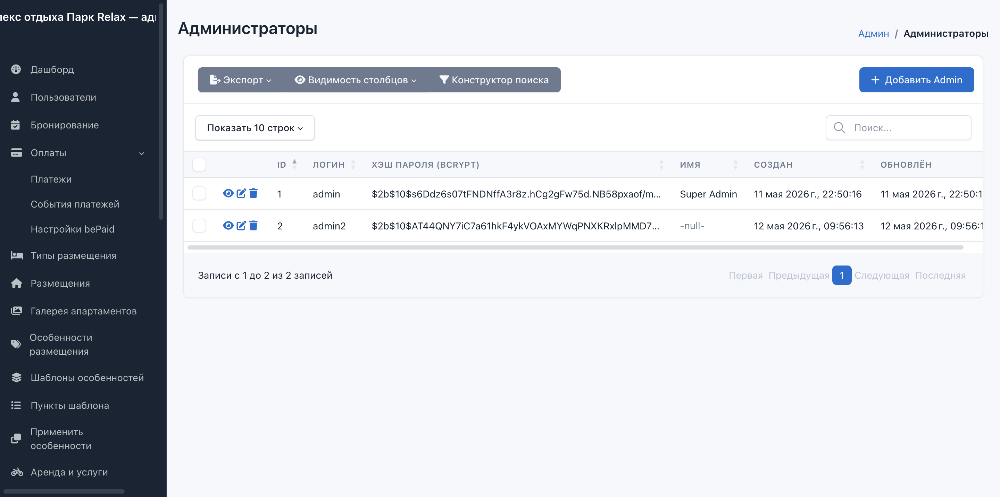

**Колонки:** ID, Email, Имя, Роль, Активен, Последний вход.

> **Безопасность:** Не создавайте учетные записи с правами superadmin без крайней необходимости. Для контент-менеджеров используйте роль editor.

---

## 21. Общие правила работы с таблицами

Во всех разделах списков работают следующие функции:

| Функция | Описание |
|---------|----------|
| **Показать N строк** | Выбор количества записей на странице (10, 25, 50, 100) |
| **Поиск** | Быстрый поиск по ключевым полям |
| **Конструктор поиска** | Расширенные фильтры по нескольким полям |
| **Видимость столбцов** | Скрытие/показ колонок |
| **Экспорт** | Выгрузка в CSV/Excel |
| **Пагинация** | Переключение между страницами |

**Иконки действий:** 👁 Просмотр, ✏️ Редактирование, 🗑 Удаление (требует подтверждения).

---

## 22. Работа с Rich Text (WYSIWYG-редактор)

Поля "Описание" используют визуальный редактор:

- **Отменить / Повторить** — стрелки влево/вправо
- **B** — жирный текст
- *I* — курсив
- **Подчеркивание** — маркер/подчеркивание
- **Выравнивание** — по левому краю, центру, правому краю, ширине
- **Списки** — маркированный и нумерованный
- **Tx** — очистка форматирования

---

## 23. Работа с изображениями

### Главное изображение (обложка)

В форме размещения поле **"Изображение"** позволяет загрузить одно фото:
- Нажмите на область загрузки или перетащите файл
- Форматы: JPG, PNG, WebP
- Рекомендуемый размер: не менее 1200×800px

### Галерея (массовая загрузка)

Поле **"Галерея (массовая загрузка + crop)"** позволяет:
- Загрузить несколько фотографий одновременно
- Кадрировать (crop) изображения прямо в админке
- Задать порядок отображения фото

---

## 24. FAQ

**Как скрыть объект с сайта, но не удалить его?**  
Откройте объект на редактирование (Размещения → ✏️) и снимите галочку **Активно**. Объект исчезнет из каталога, но останется в базе данных.

**Почему новое бронирование не отображается на сайте?**  
Проверьте статус бронирования. Только брони со статусом `confirmed` считаются подтвержденными и отображаются в личном кабинете клиента.

**Как добавить фото в существующий объект?**  
Перейдите в **Размещения** → откройте объект на редактирование → в поле **Галерея** загрузите новые фотографии → сохраните.

**Что делать, если платеж не прошел?**  
Проверьте раздел **Оплаты → События платежей**. Там будет указана причина ошибки. При системной ошибке обратитесь к разработчику.

**Как изменить email, с которого отправляются письма?**  
Перейдите в **Почта → SMTP настройки**. Измените поле "From Email". Убедитесь, что новый адрес подтвержден в настройках почтового сервера.

**Можно ли массово изменить цены?**  
Да — через **Прайс-лист**. Подготовьте Excel-файл с новыми ценами и загрузите его. Система автоматически обновит JSON-данные.

**Что означает "Показывать на главной"?**  
Объект с этой галочкой отображается в блоке "Рекомендуем" на главной странице. Используйте для продвижения популярных номеров.

**Как удалить администратора?**  
Перейдите в **Администраторы**, найдите пользователя и нажмите 🗑. Для временного отключения снимите галочку "Активен".

---

## 25. Чек-лист контент-менеджера

- [ ] Проверяйте раздел **Бронирование** минимум 1 раз в день
- [ ] Модерируйте **Отзывы** перед публикацией
- [ ] Обновляйте **Прайс-лист** при изменении цен
- [ ] Проверяйте актуальность **Контактов** (телефоны, email)
- [ ] Убедитесь, что все объекты в статусе **"Активно"** действительно доступны
- [ ] Проверяйте **Платежи** на наличие ошибок
- [ ] Проверяйте **Отправленные письма** на ошибки доставки
- [ ] Обновляйте **Слайдер** и **Галерею** сезонно

---

*Документ создан автоматически на основе актуальной структуры админ-панели.*  
*Дата создания: 2026-07-03*
